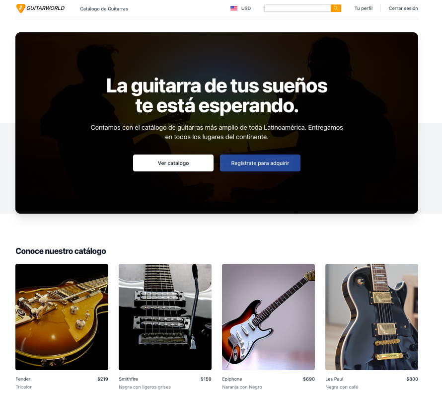

# PROYECTO 5: Aplicación de Comercio Electrónico

## **ÍNDICE**

* [1. Intro](#1-intro)
* [2. Demo](#2-demo)
* [3. ¿Qué construirás?](#3-qu%C3%A9-construir%C3%A1s)
* [4. Objetivos de Aprendizaje](#4-objetivos-de-aprendizaje)
* [5. Requisitos](#5-requisitos-y-entregables)
* [6. Criterios de evaluación](#6-criterios-de-evaluaci%C3%B3n)
* [7. Entregas](#7-entregas)

****

## 1. Intro

El comercio electrónico ha crecido en los últimos años. Cada vez, más empresas necesitan coincidir en sus procesos de comercialización una tienda online.

Realizar un proyecto de "eCommerce" es uno de los ejercicios más completos con respecto a aplicaciones "Fullstack". 

Como profesionales en desarrollo, en el momento de armar nuestra estrategia para construir una aplicación, podremos acceder a diferentes servicios como pasarelas de pago (PayPal, Stripe, MercadoPago), plataformas (Shopify, BigCommerce), CMS (Contentful, Sanity), entre otros.

****

## 2. Demo

Puedes entrar a ver el demo en este vínculo: https://boot-demos-05-2023.netlify.app/

Si necesitas descargar el proyecto, puedes ver el repositorio completo aquí: https://github.com/UDDBootcamp/BOOT-DEMOS-05

La idea es inspirarte con esta demostración de proyecto para conocer todas las características que puedes incluir. Todos los temas se vieron durante el bootcamp. Ve con cuidado en cada sección y si tienes dudas, recuerda acerca a tu equipo instruccional para revisarlo. 

****

## 3. ¿Qué construirás?

Este proyecto está enfocado en construir una aplicación de `eCommerce`.

Deberás considerar los siguientes elementos:

- Un catálogo de productos
- Un carrito de compras
- Una pasarela de pago (puntualmente PayPal o MercadoPago, con la versión de pruebas)
- Autenticación (registro de usuario e inicio de sesión, a través de JWT)
- Autorización (zona privada donde el usuario pueda ver su perfil)

Considera para el desarrollo de este proyecto, las tecnologías siguientes:

- FRONTEND
    - ReactJS
    - Context API (Manejo de estados)

- BACKEND
    - Node con ExpressJS

- BASE DE DATOS
    - MongoDB

Puedes utilizar librerías externas para completar el proyecto.

****

## 4. Objetivos de aprendizaje

Con este proyecto, nuestros objetivos serán:

- Manejo de rutas del lado del cliente (Frontend)
- Manejo de estados locales y globales (Frontend)
- Manejo de rutas en un servidor (Backend)
- Gestión y flujo de datos en MongoDB
- Seguridad (Autenticación y autorización)

****

## 5. Requisitos y entregables

Usa esta lista para saber los requisitos mínimos del proyecto:

### GENERAL

Realizarse de manera individual

### FRONTEND
- [ ] Desarrollar prototipado simple.
- [ ] Uso de ReactJS
- [ ] Uso de Context API
- [ ] Ruta de `Home`
- [ ] Ruta de `Checkout`
- [ ] Ruta de registro de usuario
- [ ] Ruta de inicio de sesión
- [ ] Ruta de "Mi perfil"
- [ ] Ruta de Producto individual
- [ ] Ruta de Listado de productos

### BACKEND
- [ ] Uso de ExpressJS
- [ ] Creación y gestión de rutas necesarias para el funcionamiento del Frontend

### DESPLIEGUE
- [ ] Crear una URL para compartir (puedes utilizar Netlify, Railway y Mongo Atlas)
- [ ] Colocar descripción dentro del repositorio

****

## 6. Criterios de evaluación

A partir de los requisitos, tu % estará definido de esta forma:

| ÁREA       | % DEL TOTAL |
| ------------- |:-------------:|
| FRONTEND + BACKEND - FLUJO DE DATOS ENTRE ELLOS      | 70%     |
| CONTROL DE VERSIONES      | 10%     |
| DESPLIEGUE | 10%      |
| ENTREGA A TIEMPO | 10%      |

****

## 7. Entregas

- **Definición de fechas.** Habla con tus coaches sobre el periodo de entregas del proyecto.

- **Cumple con los requisitos y entregables.** En caso de que no logres cumplir con todos, se te asignará un progreso proporcional a lo que lograste. Lo importante es que entregues siempre tu proyecto.
